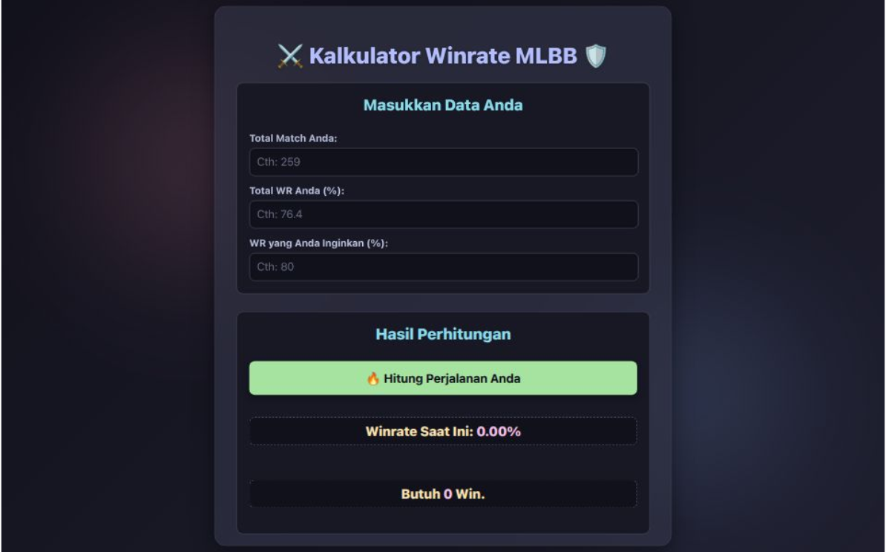

# ⚔️ MLBB Winrate & Target Calculator 🎯

*(Ganti placeholder ini dengan screenshot asli aplikasi Anda setelah deploy)*

Sebuah aplikasi web sederhana untuk menghitung winrate Mobile Legends: Bang Bang Anda saat ini dan menentukan berapa banyak kemenangan beruntun yang Anda butuhkan untuk mencapai target winrate tertentu! Dibuat dengan HTML, CSS, dan JavaScript murni, menampilkan desain modern dengan efek glassmorphism dan palet warna Catppuccin yang menawan.

---

## ✨ Fitur Utama

* **Hitung Winrate Saat Ini**: Masukkan total pertandingan dan total kemenangan Anda untuk melihat persentase winrate Anda saat ini.
* **Target Winrate**: Tentukan winrate yang ingin Anda capai (misalnya, 60% atau 70%).
* **Kemenangan Beruntun yang Dibutuhkan**: Aplikasi akan menghitung perkiraan jumlah kemenangan beruntun yang Anda perlukan untuk mencapai target winrate tersebut.
* **Desain Modern & Responsif**: Tampilan menarik dengan efek _glassmorphism_ dan palet warna Catppuccin (Mocha) yang nyaman di mata.
* **Validasi Input**: Peringatan untuk input yang tidak valid atau logika yang salah.

---

## 🚀 Cara Menggunakan

1.  **Akses Aplikasi**:
    * **Online (Vercel/GitHub Pages)**: Kunjungi [link deploy Anda di Vercel/GitHub Pages di sini](URL_DEPLOY_ANDA_DI_SINI) (Misalnya: `https://mlbb-winrate-calculator.vercel.app/` atau `https://username.github.io/nama-repo-anda/`).
    * **Lokal**:
        1.  Clone repositori ini: `git clone https://github.com/USERNAME/NAMA_REPOS_ANDA.git`
        2.  Masuk ke direktori proyek: `cd NAMA_REPOS_ANDA`
        3.  Buka file `index.html` (atau `winrate_mlbb.html` jika Anda tidak mengubah namanya) di browser web Anda.

2.  **Masukkan Data Anda**:
    * Pada kolom "Total Pertandingan", masukkan jumlah total pertandingan yang sudah Anda mainkan.
    * Pada kolom "Total Kemenangan", masukkan jumlah kemenangan yang sudah Anda raih.
    * Pada kolom "Target Winrate (%)", masukkan persentase winrate yang ingin Anda capai (contoh: `60`).

3.  **Lihat Hasil**:
    * Klik tombol "**🔥 Hitung Winrate & Target**".
    * Winrate Anda saat ini akan ditampilkan.
    * Jumlah kemenangan beruntun yang Anda perlukan untuk mencapai target winrate akan muncul di bawahnya.

---

## 🛠️ Teknologi yang Digunakan

* **HTML5**: Untuk struktur halaman.
* **CSS3**: Untuk styling dan efek visual (termasuk _glassmorphism_ dan warna Catppuccin).
* **JavaScript**: Untuk logika perhitungan winrate dan target.

---

## 🤝 Kontribusi

Saran dan kontribusi sangat diterima! Jika Anda memiliki ide untuk fitur baru, perbaikan bug, atau peningkatan desain, silakan:

1.  *Fork* repositori ini.
2.  Buat branch baru (`git checkout -b feature/nama-fitur`).
3.  Lakukan perubahan Anda.
4.  *Commit* perubahan Anda (`git commit -m 'Add new feature'`).
5.  *Push* ke branch Anda (`git push origin feature/nama-fitur`).
6.  Buka *Pull Request* baru.

---

## 📄 Lisensi

Proyek ini dilisensikan di bawah [MIT License](LICENSE).

---

## 📧 Kontak

Jika Anda memiliki pertanyaan atau ingin menghubungi, Anda bisa menemukan saya di [Profil GitHub Anda](https://github.com/USERNAME_GITHUB_ANDA).

---
